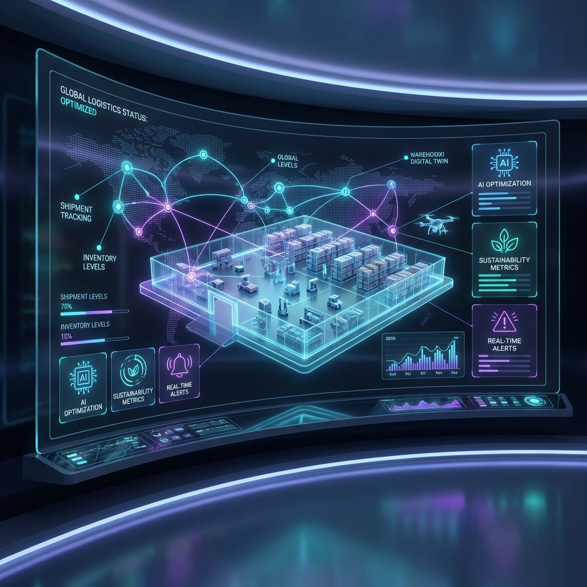

# 🌌 StarPath IOE: The Operating System for Physical Reality

[](https://github.com/RaunaqR66996/Starpath-IOE)
[](https://github.com/RaunaqR66996/Starpath-IOE)
[](https://github.com/RaunaqR66996/Starpath-IOE)

**StarPath IOE (Integrated Operations Environment)** is an AI-native operating system designed to unify logistics operations for U.S. supply chain resilience. It replaces fragmented legacy silos (ERP, WMS, TMS) with a unified **System of Reality**.



---

## 🚀 The Vision: Beyond Records, Into Orchestration

Traditional supply chain management suffers from the **"Latency Gap"**—a 24-48 hour information lag where ERPs, WMS, and TMS operate as isolated islands. StarPath collapses these silos into a single, real-time **Unified Data Fabric** for your entire operation.

### Key Pillars of the IOE:

#### 1. 🏗️ 3D Digital Twin (High-Fidelity Rendering)
Moving beyond static spreadsheets, StarPath provides a pixel-perfect, 3-acre 3D visualization of your facility.
- **Spatial Intelligence**: Real-time warehouse heatmaps and pick-path optimization.
- **Hardware Agnostic**: Native integration with AMR (Autonomous Mobile Robots) and LiDAR telemetry.
- **Asset Health**: Predictive maintenance tracking with MTBF monitoring.

#### 2. 🛰️ Network Command (PMESII Framework)
A global control tower inspired by military-grade operational frameworks.
- **Multi-Node Visibility**: Track hundreds of active nodes and "In-Transit" shipments in real-time.
- **Operational Graph**: Holistic view of Political, Military, Economic, Social, Infrastructure, and Information dependencies.
- **Risk Mitigation**: Autonomous inter-site transfer suggestions to prevent stockouts.

#### 3. 🧠 Agentic AI (FAR Architecture)
The **FAR Engine**—our "Fission-Augmented Reasoning" architecture—provides System 2 thinking for your supply chain.
- **Chain Reaction Analysis**: Simulates downstream effects of every decision before execution.
- **Multi-Agent Consensus**: Collaborative AI agents (utilizing Ensemble Debate) filtered by a "Consensus Arbiter" for hallucination-free reasoning.
- **Deterministic Planning**: Finite-capacity APS engine that respects real-world constraints like machine health and labor shifts.

#### 4. 💸 Enterprise TMS & Financial Controller
A high-fidelity logistics and resource management suite.
- **Dispatcher Workbench**: Integrated Load Planner with dock scheduling and driver availability.
- **Continuous Audit**: Automated freight bill audit comparing every invoice against actual shipment rates.
- **ESG Native**: Real-time CO2 impact tracking and renewable energy ranking for every facility.

---

## 🛠️ Tech Stack: The Modern Industrial Base

Built with a "Google-inspired" engineering culture, the StarPath stack is designed for speed, scale, and resilience.

- **Frontend**: [Next.js 16](https://nextjs.org/) (App Router), [React 19](https://react.dev/), [Tailwind CSS 4](https://tailwindcss.com/)
- **Visualization**: [Three.js](https://threejs.org/) & [React Three Fiber](https://docs.pmnd.rs/react-three-fiber/) (3D), [Mapbox GL](https://www.mapbox.com/) (Logistics)
- **Backend**: [Prisma](https://www.prisma.io/) ORM, [Supabase](https://supabase.com/)/PostgreSQL
- **AI/ML**: Custom FAR (Fission Automated Reasoning) architecture
- **State Management**: [Zustand](https://github.com/pmndrs/zustand)
- **Animations**: [Framer Motion](https://www.framer.com/motion/)

---

## 🏁 Getting Started

### Prerequisites
- Node.js 18+
- PostgreSQL instance (or Supabase)
- Mapbox API Key

### Installation

1. **Clone the repository**
   ```bash
   git clone https://github.com/RaunaqR66996/Starpath-IOE.git
   cd Starpath-IOE/ioe-system
   ```

2. **Install dependencies**
   ```bash
   npm install
   ```

3. **Configure Environment**
   Create a `.env` file in `ioe-system/`:
   ```env
   DATABASE_URL="your-postgresql-url"
   NEXT_PUBLIC_MAPBOX_TOKEN="your-mapbox-token"
   ```

4. **Initialize Database**
   ```bash
   npx prisma migrate dev
   npm run prisma:seed
   ```

5. **Launch Command Center**
   ```bash
   npm run dev
   ```

---

## 🗺️ Roadmap: The Path to Q4 2026

- [x] **Q1 2026**: "Execution & Visibility" MVP Launch
- [ ] **Q2 2026**: Pilot deployment with mid-market 3PL partners
- [ ] **Q3 2026**: Closing the loop on Inbound/Procurement
- [ ] **Q4 2026**: General Availability & Intelligence Layer (Solver Integration)

---

## 📄 License & Team

**Founder**: [Raunaq Fardeen](https://github.com/RaunaqR66996)  
Built with the goal of re-industrializing the American supply chain stack.

*Disclaimer: This project is part of a strategic initiative for American Dynamism and global logistics resilience.*
