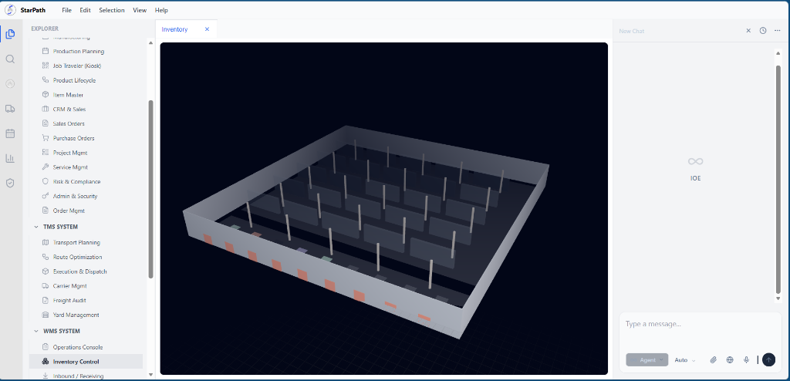

# StarPath IOE

StarPath IOE (Integrated Operations Environment) is an operating system designed to unify logistics operations. It replaces fragmented siloed systems (ERP, WMS, TMS) with a unified data environment.

## Overview

Traditional supply chain management creates information lag where ERPs, WMS, and TMS operate disconnected. StarPath creates a real-time data fabric for the operation.

### Key Capabilities

**1. 3D Digital Twin**
Provides a high-fidelity 3D visualization of the facility.
- **Spatial Intelligence**: Real-time warehouse heatmaps and pick-path optimization.
- **Hardware Agnostic**: Integration with AMR (Autonomous Mobile Robots) and LiDAR telemetry.
- **Asset Health**: Predictive maintenance tracking.

**2. Enterprise TMS & Financial Controller**
High-fidelity logistics and resource management suite.
- **Dispatcher Workbench**: Integrated Load Planner with dock scheduling and driver availability.
- **Continuous Audit**: Automated freight bill rating and cost estimation for every shipment.
- **ESG Framework**: Architecture for tracking CO2 impact and renewable energy usage metrics.

## Built for High-Velocity Operations

*   **Eliminate Information Latency**: Replace 24-hour reporting cycles with sub-second inventory visibility. Track stock levels, quality status, and precise bin locations in real-time.
*   **Algorithmic Logistics**: Move beyond manual dispatching. Use intelligent load planning to optimize routes, assign drivers, and synchronize dock schedules to maximize asset utilization.
*   **Industry 4.0 Ready**: A true "System of Reality" that ingests live telemetry from AMRs, LiDAR sensors, and forklifts, visualizing operations as they happen, not as they were planned.
*   **Automated Revenue Protection**: Stop revenue leakage with continuous freight bill auditing. Instantly compare invoiced amounts against contracted rates to catch discrepancies.
*   **Global Command Center**: A unified operational graph that visualizes your entire supply chain network—from supplier nodes to final mile dispatch—on an interactive, data-dense map.

## Tech Stack

Designed for performance, type-safety, and developer experience.

- **Frontend**: **Next.js 16** (App Router) & **React 19** for a high-performance, server-first architecture.
- **Styling**: **Tailwind CSS 4** for rapid, utility-first design.
- **Visualization**: **Three.js** & **React Three Fiber** for hardware-accelerated 3D rendering; **Mapbox GL** for geospatial data.
- **Backend & Data**: **Prisma ORM** with **PostgreSQL** for type-safe database access and reliability.
- **State**: **Zustand** for transient, high-frequency state updates.

- **State**: **Zustand** for transient, high-frequency state updates.

## Current Status: Prototype

This application is currently a **High-Fidelity Software Prototype**. While the visualization and logic engines are functional, full production deployment faces the following technical dependencies:

*   **Hardware Barriers**: The "Digital Twin" currently relies on simulated telemetry. Operational deployment requires integration with physical **LiDAR arrays** and **V2X (Vehicle-to-Everything)** communication modules to drive the real-time 3D view.
*   **Software Integration**: The system is designed to act as an orchestration layer. Final implementation requires the development of secure, low-latency **ERP Adaptors** (for SAP/Oracle) to replace the current standalone database architecture.

## License

This project is proprietary software. All rights reserved.
