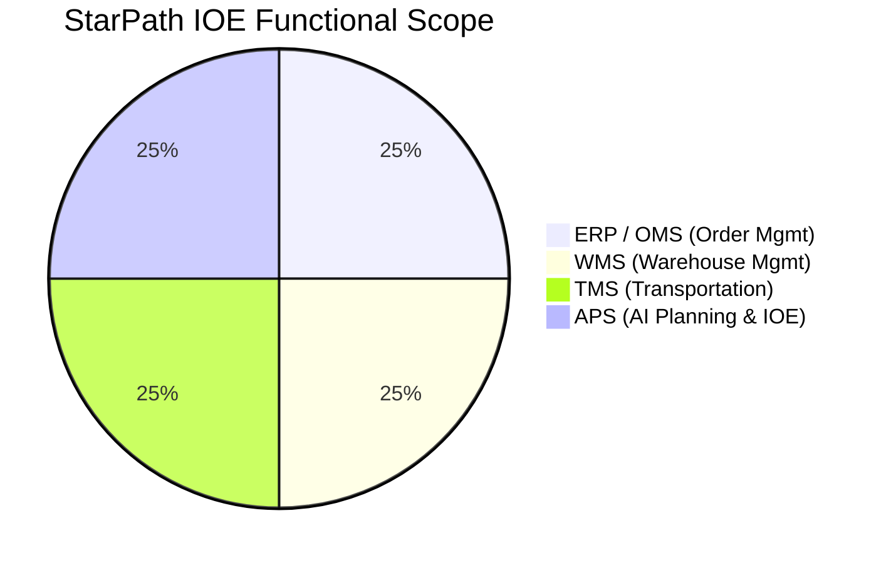
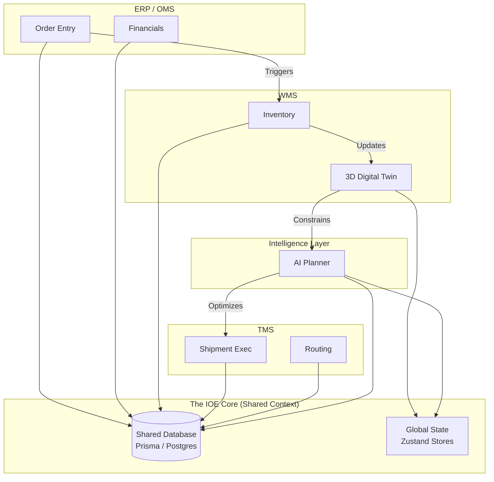

# StarPath IOE: System Architecture & Module Mapping

This document maps the **StarPath Integrated Operation Environment (IOE)** codebase to standard enterprise modules (ERP, WMS, TMS), highlighting the "Equal Weight" functional coverage and the integrated "Overlap" that defines the IOE.

## 1. Functional Module Scope (Equal Weight)

The StarPath IOE unifies three traditionally separate domains into a single workspace.

### Module Mapping

| Module | Industry Standard | StarPath Implementation | Key Components / Models |
| :--- | :--- | :--- | :--- |
| **ERP** | Order to Cash, Financials, CRM | **OMS (Order Management)** | `Order`, `Customer`, `OrderLine` `CreateOrderModal`, `CustomerGrid` |
| **WMS** | Inventory, Labor, Pick/Pack | **WMS + 3D Twin** | `Inventory`, `WarehouseTask`, `ZoneMetric` `Warehouse3DScene`, `InventoryWorkspace` |
| **TMS** | Freight, Carriers, Routing | **TMS (Transportation)** | `Shipment`, `Freight`, `Address` `ShipmentGrid`, `ShipmentsMap` |
| **APS** | Forecasting, Production Planning | **IOE / Planner** | `PlanningAI`, `PlanningNavigator` `@starpath/planner` package |

---

## 2. The Integrated Overlap (IOE Architecture)

Unlike disjointed systems, StarPath shares a single brain (Data & Logic).

## 3. Implementation Details

### Shared Database Schema (Prisma)
The schema (`prisma/schema.prisma`) enforces the integration at the data level:
- **`Order`** (ERP) is directly related to **`Shipment`** (TMS).
- **`OrderLine`** (ERP) drives **`WarehouseTask`** (WMS).
- **`Inventory`** (WMS) is integrated with **`ZoneMetric`** (Analytics).

### Unified Frontend (Next.js)
The `ioe-system` workspace brings all modules into a single "Single Pane of Glass" UI:
- **`/components/ioe/erp`**: Order grids and customer views.
- **`/components/ioe/tms`**: Shipment tracking and maps.
- **`/components/ioe/inventory`**: WMS tables and 3D scenes.
- **`/components/ioe/planning`**: The AI/Control Tower interface.
